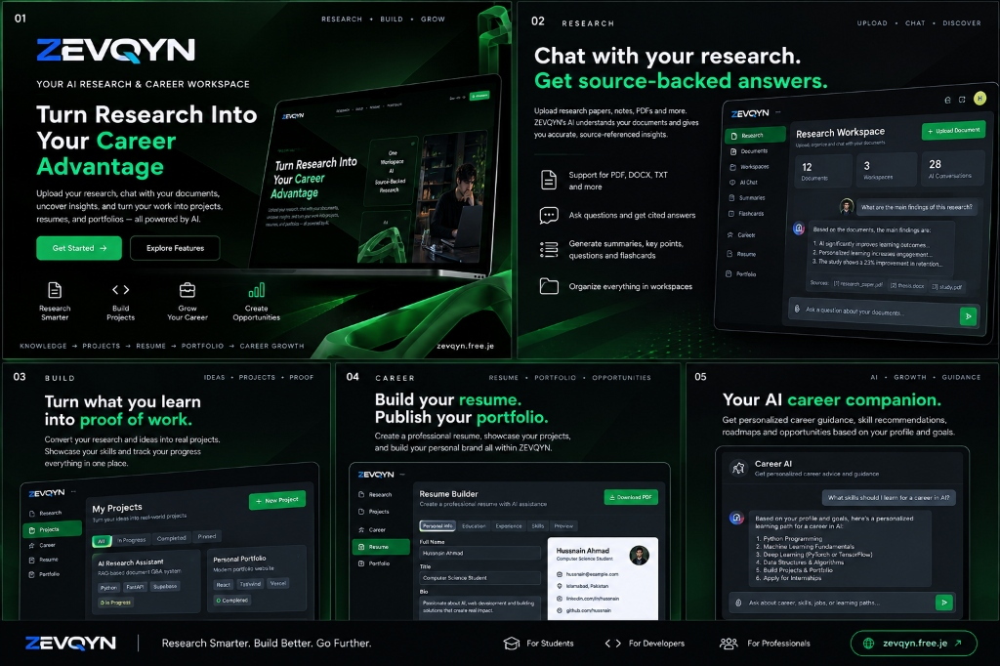

# ZEVQYN

**AI Research + Career Workspace**

> Upload your research, chat with your documents, uncover insights, and turn your work into projects, resumes, and portfolios — all powered by AI.

🌐 **Live Website:** [https://zevqyn.free.je/](https://zevqyn.free.je/)

📦 **This Repository:** Frontend source archive for ZEVQYN V1

<p align="center">
  
</p>

---

## What is ZEVQYN?

ZEVQYN is an AI-powered workspace that connects the entire journey from academic research to career growth. Users upload research documents, interact with them through AI-powered chat (RAG), generate study tools, build projects from their research, create professional resumes and portfolios, and receive personalized career guidance — all within one integrated platform.

### Core Workflow

```
Research → Project → Resume → Portfolio → Career Growth
```

---

## Architecture

```
┌─────────────────────────────────────────┐
│              Browser (User)             │
└──────────────────┬──────────────────────┘
                   │
┌──────────────────▼──────────────────────┐
│        WordPress Frontend (V1)          │
│     Blocksy Theme + Greenshift Blocks   │
│      Custom HTML / CSS / JavaScript     │
│         Hosted on InfinityFree          │
└──────────────────┬──────────────────────┘
                   │ REST API
┌──────────────────▼──────────────────────┐
│          FastAPI Backend (Python)        │
│           Hosted on Render              │
│  https://zevqyn-backend.onrender.com    │
└───────┬──────────────────┬──────────────┘
        │                  │
┌───────▼───────┐  ┌───────▼───────┐
│   Supabase    │  │ Google Gemini │
│  PostgreSQL   │  │   AI / LLM    │
│  Auth         │  │  Embeddings   │
│  Storage      │  │   RAG         │
│  pgvector     │  │               │
└───────────────┘  └───────────────┘
```

---

## Technology Stack

### Frontend
| Technology | Purpose |
|---|---|
| WordPress 7.1.1 | CMS platform |
| Blocksy Theme | Base theme (Codespot starter) |
| Greenshift Blocks | Page builder (marketing pages) |
| Custom HTML/CSS/JS | Application pages (dashboard, workspaces, builders) |
| Supabase JS SDK v2 | Client-side authentication |

### Backend
| Technology | Purpose |
|---|---|
| Python | Server language |
| FastAPI | REST API framework |

### Data & AI
| Technology | Purpose |
|---|---|
| Supabase PostgreSQL | Primary database |
| Supabase Auth | User authentication |
| Supabase Storage | File storage |
| pgvector | Vector similarity search |
| Google Gemini | LLM / AI generation |
| Gemini Embeddings | Document vectorization |
| RAG Architecture | Source-grounded AI responses |

### Deployment
| Service | Component |
|---|---|
| InfinityFree | Frontend hosting |
| Render | Backend hosting |
| GitHub | Version control |

---

## Product Features

### Public Marketing
- **Home** — Landing page with value proposition and feature overview
- **Features** — Detailed 8-feature product showcase
- **How It Works** — 6-step interactive walkthrough
- **About** — Brand story and team
- **Contact** — Contact form with FAQ

### Authentication
- **Register** — Account creation with Supabase Auth
- **Login** — Email/password sign-in

### Application
- **Dashboard** — Aggregated metrics, recent workspaces, career workflow tracker
- **Global Documents** — Centralized document explorer with search, type/status filters, and workspace mapping
- **Research Hub** — Create and manage research workspaces
- **Research Workspace** — Document upload, RAG AI chat, AI study tools (summaries, key points, questions, flashcards), research-to-project conversion
- **Projects** — Project management with search, filtering, and sorting
- **Project Workspace** — Full project editor with tag managers and research traceability
- **Career Hub** — Central career data repository (profile, skills, education, certificates)
- **Resume Builder** — Multi-resume management with drag-and-drop / keyboard reordering, live ATS preview, and PDF export
- **Portfolio Builder** — Portfolio creation with live preview and public URL
- **Public Portfolio** — Public-facing portfolio viewer (no authentication required)
- **Career AI** — AI copilot with chat and 6 specialized tools (profile analysis, skill gaps, project ideas, resume review, portfolio review, action plans)
- **Settings** — Account management, password change, sign out
- **Admin Inbox** — Admin contact message management

---

## ZEVQYN V1.1 UI/UX Refinement & Backend Integration

This branch (`v1.1-ui-refinement`) contains the **V1.1 design refinement and Backend V1.1 integration** for the entire ZEVQYN frontend suite (all 20 pages).

The objective of V1.1 is to eliminate the "AI-generated SaaS" aesthetic (glowing borders, continuous conic keyframes, excessive glassmorphism, muddy gradients, 24px pills, 8–9px micro-fonts), elevate ZEVQYN into an institutional, engineering-grade AI workspace (Linear, Cursor, Notion style), and integrate newly released Backend V1.1 capabilities.

### Key Refinement & Integration Documents
- **[Design System V1.1](docs/DESIGN_SYSTEM_V1_1.md)** — Semantic color tokens (`--zev-*`), typography, elevation, focus states, and component patterns.
- **[UI/UX Audit V1](docs/UI_UX_AUDIT_V1.md)** — Comprehensive 800+ line audit of all pages with risk matrix and anti-pattern catalogue.
- **[V1.1 Frontend Backend Integration Report](docs/V1_1_FRONTEND_BACKEND_INTEGRATION_REPORT.md)** — Complete report detailing Resume Reordering, Research Conversation Deletion, Global Documents, and Career AI Deprecation.
- **[V1.1 Refinement Report](docs/V1_1_REFINEMENT_REPORT.md)** — Full execution report detailing visual enhancements, JS preservation, and regression verification across all pages.
- **[WordPress Migration Checklist](docs/V1_1_WORDPRESS_MIGRATION_CHECKLIST.md)** — Production deployment playbook for safe, sequential rollout to WordPress.

### V1.1 Highlights
- **Engineering-Grade Aesthetic:** Deep charcoal/slate backgrounds (`#0B0D11`, `#11141B`, `#181C24`), disciplined monochrome surfaces, and subtle precision accents (`#10B981` emerald, `#059669` forest).
- **Backend V1.1 Feature Suite Integrated:**
  - **Resume Item Reordering:** Drag-and-drop & keyboard Up/Down reordering with section boundary enforcement and bulk `PATCH /api/v1/resumes/{id}/items/reorder`.
  - **Research Conversation Deletion:** Thread management in Research Workspace sidebar with `DELETE /api/v1/workspaces/{w_id}/conversations/{c_id}` and active chat reset.
  - **Global Documents Page:** Full dedicated page at `/documents/` calling `GET /api/v1/documents` with client-side workspace name resolution.
  - **Career AI Alignment:** Confirmed zero calls to deprecated legacy `POST /api/v1/career/assistant`.
- **Zero API or Logic Regressions:** 100% DOM element IDs, class bindings, and event handlers preserved across all 15,000+ lines of custom JavaScript. Working backend API contracts (`https://zevqyn-backend.onrender.com`) and Supabase Auth remain completely untouched.
- **ATS Resume Paper Verbatim:** `#zevqyn-resume-preview` and `.zev-rb-preview-paper` styling remain byte-identical to maintain exact 1:1 fidelity with Python ReportLab backend PDF generator.
- **Accessibility & Contrast:** High-contrast text throughout (4.5:1+), WCAG compliant `:focus-visible` rings on all interactive elements, and `@media (prefers-reduced-motion)` guards.
- **100% Automated Regression Pass:** 120/120 files verified with 0 errors, 0 warnings, 0 forbidden AI tropes, 0 broken links, and 0 secret leaks.

---

## Repository Structure

```
zevqyn/
├── pages/                        # Page source from WordPress export & V1.1 refinements
│   ├── home/                     # Marketing landing page (Greenshift blocks)
│   ├── features/                 # Feature showcase (custom HTML/CSS/JS)
│   ├── how-it-works/             # Walkthrough (custom HTML/CSS/JS)
│   ├── about/                    # About page (custom HTML/CSS/JS)
│   ├── contact/                  # Contact form (custom HTML/CSS/JS)
│   ├── login/                    # Login page (Supabase Auth)
│   ├── register/                 # Registration (Supabase Auth)
│   ├── dashboard/                # User dashboard
│   ├── documents/                # Global Documents library (new in V1.1)
│   ├── research/                 # Research hub
│   ├── research-workspace/       # Research workspace with AI tools
│   ├── projects/                 # Projects hub
│   ├── project-workspace/        # Project editor
│   ├── career/                   # Career Hub
│   ├── resume/                   # Resume Builder (ATS verbatim preview)
│   ├── portfolio/                # Portfolio Builder
│   ├── public-portfolio/         # Public portfolio viewer (slug: /p/)
│   ├── career-ai/                # Career AI copilot
│   ├── settings/                 # Account settings
│   └── admin-inbox/              # Admin contact inbox
│       # Each page folder contains:
│       #   content.html, style.css, script.js, wordpress-blocks.html,
│       #   README.md, MIGRATION_NOTES_V1_1.md
├── assets/
│   ├── css/
│   │   └── custom-theme.css      # WordPress Customizer CSS (V1.1 design tokens & resets)
│   └── README.md
├── wordpress-export/
│   └── zevqyn.WordPress.2026-09-20.xml
├── docs/
│   ├── DESIGN_SYSTEM_V1_1.md               # V1.1 semantic token system & component standards
│   ├── UI_UX_AUDIT_V1.md                   # 19-page audit & risk matrix
│   ├── V1_1_REFINEMENT_REPORT.md           # Comprehensive V1.1 refinement report
│   ├── V1_1_WORDPRESS_MIGRATION_CHECKLIST.md # Step-by-step WordPress deployment checklist
│   ├── ARCHITECTURE.md
│   ├── FRONTEND_STRUCTURE.md
│   ├── WORDPRESS_SETUP.md
│   └── EXTRACTION_REPORT.md
├── .gitignore
├── LICENSE
└── README.md
```

---

## About This Repository

This repository is the **frontend source archive** for ZEVQYN V1. It preserves the custom HTML, CSS, and JavaScript that powers the ZEVQYN application, extracted from the production WordPress installation.

> **Important:** This is not a standalone runnable application. The production ZEVQYN frontend runs on WordPress with the Blocksy theme and Greenshift block plugin. The custom code in this repository is embedded within WordPress pages using `wp:html` blocks and Greenshift block markup.

### What's Included
- All published page source code from the WordPress export
- Custom CSS from the WordPress Customizer
- WordPress WXR/XML export as reference
- Architecture and setup documentation

### What's Not Included
- WordPress core files, theme files, or plugin files
- Backend source code (separate repository)
- Database content or user data
- Media files (referenced via production URLs)

---

## Related

- **Backend Repository:** Separate (Python/FastAPI)
- **Production Frontend:** [https://zevqyn.free.je/](https://zevqyn.free.je/)
- **Production Backend:** [https://zevqyn-backend.onrender.com](https://zevqyn-backend.onrender.com)

---

## License

© 2025–2026 ZEVQYN. All rights reserved.

This project is proprietary. No license is granted for use, modification, or distribution unless explicitly authorized by the project owner.

---

## Author

Built by [hussnain](https://github.com/hussnainahmedd)
