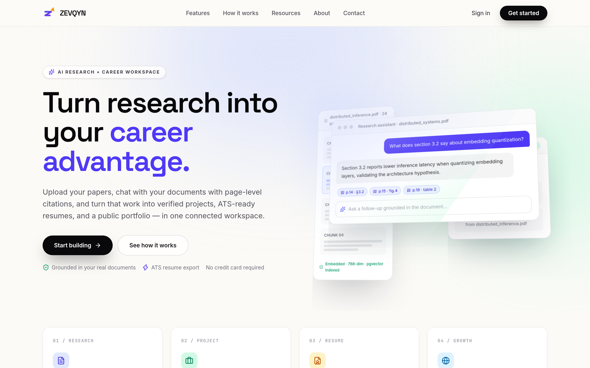
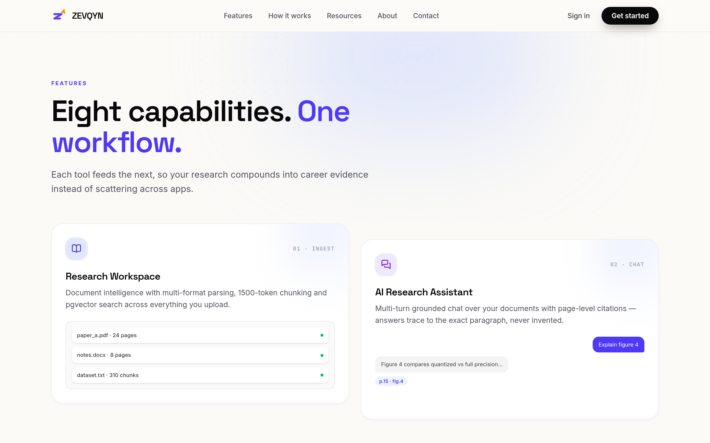

# ZEVQYN — AI Research + Career Workspace

**Turn research into your career advantage.** Upload papers, chat with your documents with page-level citations, and turn that work into verified projects, ATS-ready resumes, and a public portfolio — in one connected workspace.

🌐 **Live:** https://zevqyn.dev



## The journey

**Research → Project → Resume → Portfolio → Growth.** Each tool feeds the next, so your research compounds into career evidence instead of scattering across apps.



## What it does

- **Research Workspace** — document intelligence with multi-format parsing, 1500-token chunking, and pgvector search across everything you upload
- **AI Research Assistant** — multi-turn grounded chat over your documents with page-level citations; answers trace to the exact paragraph, never invented
- **Ask with citations** — summaries, key points, study questions, and flashcards generated from your own documents
- **Projects** — turn research into verified project entries with evidence attached
- **Resume Builder** — ATS-friendly resumes with PDF export, built from your real work
- **Portfolio** — dark, attractive public portfolio pages (`/p/[slug]`) with profile-picture upload
- **Career AI** — career guidance grounded in your profile and documents
- **Email verification** — Supabase "Confirm email" with a polished check-your-email flow, resend, and `/auth/callback` verification handling

## Stack

**Frontend:** Next.js (App Router) + TypeScript + Tailwind CSS v4 · `@tanstack/react-query` · `react-hook-form` + `zod` · `@supabase/supabase-js` · `lucide-react`

**Backend:** FastAPI + Supabase (Postgres + pgvector + Auth + Storage). Gemini runs only via the backend — the frontend never holds model keys.

**Infra:** Vercel (frontend, `zevqyn.dev`) · Render (backend) · Supabase (database, auth, storage) · Resend (custom SMTP for auth emails)

## Project structure

- `src/lib/env.ts` — public env only. `src/lib/supabase.ts` — single Supabase client (publishable key only; never service-role).
- `src/lib/api/client.ts` — centralized authenticated fetch (Bearer <redacted>, 401 redirect, error normalization). `src/lib/api/services.ts` — typed domain services. No scattered raw fetch in pages.
- Routes: marketing `/` `/features` `/how-it-works` `/about` `/contact`, auth `/login` `/register`, app `/app/*` (dashboard, workspaces + research studio, documents, projects, career, resume, portfolio, career-ai, settings), public `/p/[slug]` (SSR).
- Content: `/resources` + `/resources/[slug]` (8 original starter articles), `/faq`, `/privacy-policy`, `/terms`, `/cookie-policy`, `/disclaimer`, `/sitemap.xml`, `/robots.txt`.

## Setup

```bash
npm install
cp .env.example .env.local   # fill in public values
npm run dev                  # build: npm run build
```

Env names (values never committed):

- `NEXT_PUBLIC_API_BASE_URL`
- `NEXT_PUBLIC_SUPABASE_URL`
- `NEXT_PUBLIC_SUPABASE_ANON_KEY` (publishable/anon only)

## Deploy (Vercel + zevqyn.dev)

Import this repo in Vercel, set the three env vars, deploy (push → auto-deploy). Add `zevqyn.dev` + `www.zevqyn.dev` in Vercel Domains, add the shown DNS records (A `@`, CNAME `www`) at the registrar, set apex primary. Then update Render `CORS_ORIGINS` to include `https://zevqyn.dev` and Supabase Auth redirect URLs. Frontend code uses relative routes, so no hard-coded frontend domain.

**Auth email (Supabase → Resend custom SMTP):** Supabase Dashboard → Authentication → Emails → SMTP Settings → Enable custom SMTP. Host `smtp.resend.com`, port `587`, username `resend`, password = Resend API key. Verify `zevqyn.dev` in Resend (DKIM/SPF/DMARC DNS records) and use `noreply@zevqyn.dev` as the sender.

## License

Proprietary — © 2025–2026 ZEVQYN. All rights reserved. See [LICENSE](./LICENSE). No license is granted for use, modification, or distribution unless explicitly authorized in writing by the project owner.
